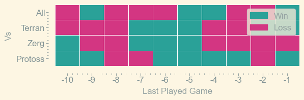
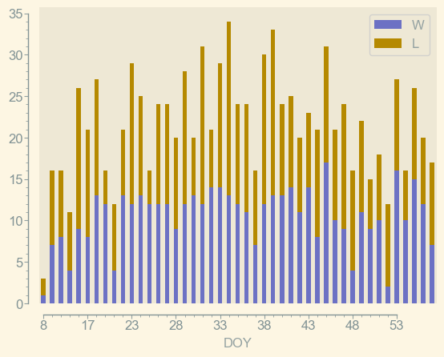
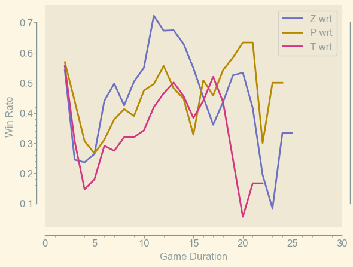

<h1> UpATree</h1>

 

    

        <h2> Ladder Stats</h2>
        <table>
  <thead>
    <tr style="text-align: right;">
      <th></th>
      <th>Stats</th>
    </tr>
  </thead>
  <tbody>
    <tr>
      <td>Matches Played</td>
      <td>975</td>
    </tr>
    <tr>
      <td>MMR Gained</td>
      <td>9377</td>
    </tr>
    <tr>
      <td>MMR lost</td>
      <td>9614</td>
    </tr>
    <tr>
      <td>Max MMR</td>
      <td>4846</td>
    </tr>
    <tr>
      <td>Min MMR</td>
      <td>4458</td>
    </tr>
    <tr>
      <td>Longest Win Streak</td>
      <td>9</td>
    </tr>
    <tr>
      <td>Longest Loss Streak</td>
      <td>8</td>
    </tr>
    <tr>
      <td>Highest MMR Beaten</td>
      <td>6219</td>
    </tr>
    <tr>
      <td>Lowest MMR Thrown to</td>
      <td>2956</td>
    </tr>
  </tbody>
</table>
    

    

        <h2>Nemeses</h2>
        <table>
  <thead>
    <tr style="text-align: right;">
      <th>Opponent</th>
      <th>ΔMMR</th>
    </tr>
  </thead>
  <tbody>
    <tr>
      <td>Kallari</td>
      <td>270</td>
    </tr>
    <tr>
      <td>gaschem</td>
      <td>255</td>
    </tr>
    <tr>
      <td>Hirisch</td>
      <td>249</td>
    </tr>
    <tr>
      <td>OriOn</td>
      <td>157</td>
    </tr>
    <tr>
      <td>theglml</td>
      <td>153</td>
    </tr>
    <tr>
      <td>Archaleon</td>
      <td>149</td>
    </tr>
    <tr>
      <td>GhostDragon</td>
      <td>122</td>
    </tr>
    <tr>
      <td>Kyoshi</td>
      <td>101</td>
    </tr>
    <tr>
      <td>BaumesBaum</td>
      <td>99</td>
    </tr>
    <tr>
      <td>igor</td>
      <td>99</td>
    </tr>
  </tbody>
</table>
    

## Games by Race

| Race    |   Wins |   Losses |   Total |   Win Rate (%) |   MMR Gained |   MMR Lost |
|:--------|-------:|---------:|--------:|---------------:|-------------:|-----------:|
| Protoss |    173 |      218 |     391 |        44.2455 |         3265 |       3497 |
| Terran  |     95 |      131 |     226 |        42.0354 |         2335 |       1804 |
| Zerg    |    206 |      151 |     357 |        57.7031 |         3240 |       3250 |

